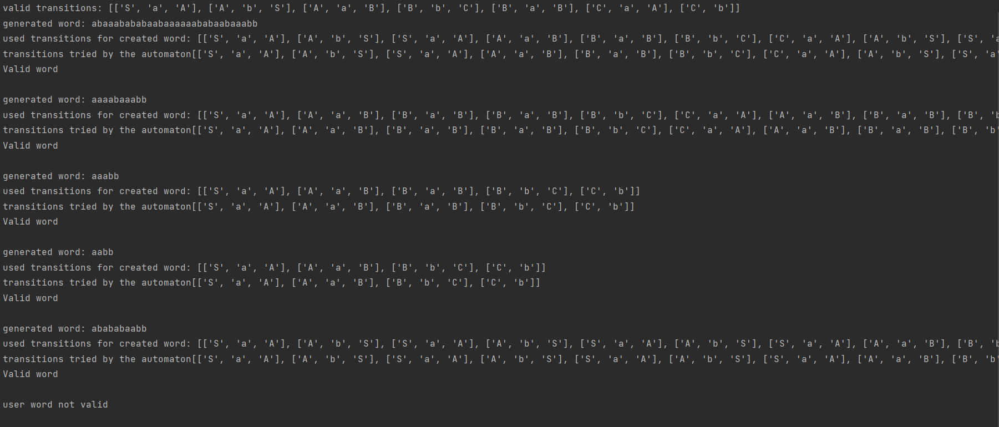
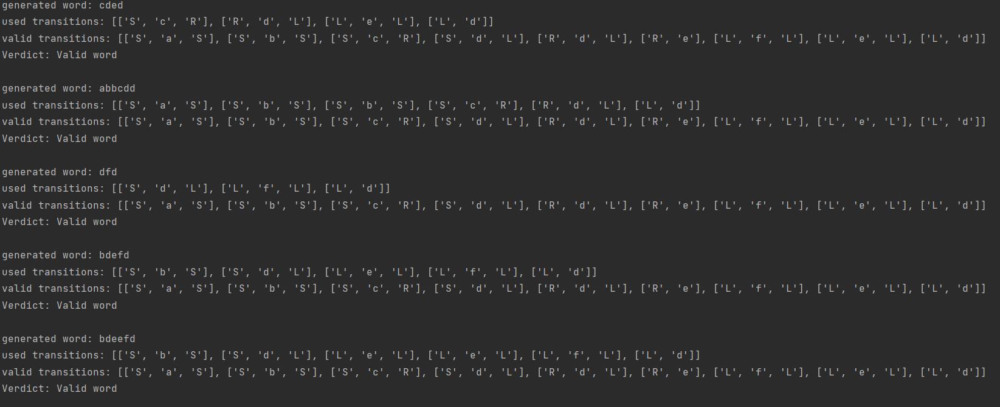

# Laboratory work no. 1 report.
### Course: Formal Languages & Finite Automata
### Author: Ursu Vlad, st. gr. FAF-212 (variant 28)

---

## Objectives:
1. Understand what a language is and what it needs to have in order to be considered a formal one.

2. Provide the initial setup for the evolving project that you will work on during this semester. I said project because
usually at lab works, I encourage/impose students to treat all the labs like stages of development of a whole project. 
Basically you need to do the following:

    a. Create a local && remote repository of a VCS hosting service (let us all use Github to avoid unnecessary headaches);

    b. Choose a programming language, and my suggestion would be to choose one that supports all the main paradigms;

    c. Create a separate folder where you will be keeping the report. This semester I wish I won't see reports alongside
source code files, fingers crossed;

3. According to your variant number (by universal convention it is register ID), get the grammar definition and do the 
following tasks:

    a. Implement a type/class for your grammar;

    b. Add one function that would generate 5 valid strings from the language expressed by your given grammar;

    c. Implement some functionality that would convert and object of type Grammar to one of type Finite Automaton;
    
    d. For the Finite Automaton, please add a method that checks if an input string can be obtained via the state 
transition from it;

---

## Implementation description:
To begin with, the grammar provided for the formal language inserted into lists and the transitions are initially 
transfered into a dictionary:
```
vn = ['S','A','B','C']
vt = ['a','b']
p = {
    'S':['aA'],
    'A':['bS','aB'],
    'B':['bC','aB'],
    'C':['aA','b'],
}
```
A dictionary is preferred for it being comfortable in linking the transitions. A clever workaround applied were the
lists used to link the multiple paths a key can take.
Afterwards, an instance of the RegularGrammar class is created, its attributes being the already established grammar.

RegularGrammar has 2 methods, one for generating a random word based on the given grammar, and a second one for
transforming the data to a finite automaton type object. The GenerateWord method creates a word by randomly circulating
the paths of the dictionary, until a final state is reached, meanwhile registering and keeping tabs on the transitions
that brought the word to life.

The ConvertFA method helps turning the grammar, together with its transitions into a valid finite automaton with all its 
typical attributes (finite set of states, alphabet, transition set, initial states, and accepting states)

The Finite Automata class contains a simple method that checks whether the word is valid. It basically checks the final 
initial states, the alphabet used in the word, and most important if the word can be obtained by the transitions layed 
out from the grammar.

The transitions were switched however, from dictionaries to simple lists, for more comfortable use, and because of
necessary key duplication, as well as the algorithm for validating words.

---

## Conclusions / Screenshots / Results

In the end, the created program proved itself capable of generating valid words from the regular grammar provided, and
additionally to check them using an automaton with specific attributes for the grammar. In this particular instance, 
a user defined word was tested after generating the 5 valid ones.
### Practical results:


An upside of the program is that is works for any given grammar, not only the given variant. For example variant 2 from 
the same laboratory:


