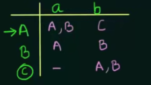
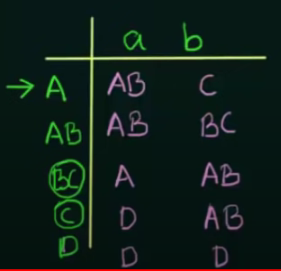

# Laboratory work no. 2 report.
### Course: Formal Languages & Finite Automata
### Author: Ursu Vlad, st. gr. FAF-212 (variant 28)

---

## Objectives:
1. Understand what an automaton is and what it can be used for.

2. Continuing the work in the same repository and the same project, the following need to be added:
    a. Provide a function in your grammar type/class that could classify the grammar based on Chomsky hierarchy.

    b. For this you can use the variant from the previous lab.

3. According to your variant number (by universal convention it is register ID), get the finite automaton definition and
4. do the following tasks:

    a. Implement conversion of a finite automaton to a regular grammar.

    b. Determine whether your FA is deterministic or non-deterministic.

    c. Implement some functionality that would convert an NDFA to a DFA.

---

## Implementation description:

### 1. Creating the method that can determine the grammar type based on Chomsky hierarchy.
A method is added to the RegularGrammar that checks for each Chomsky rule in turn.
The method checks first for the Type 0, and Type 1,
```
        for key in self.P:
            if len(key)>=2:
                chum_type = 1
            for state in self.P[key]:
                if state == '' and chum_type == 1:
                    return 0

        if chum_type==1:
            return 1
```
It essentially checks for more than one element to the left of the transition, and if this condition is met, than it
lands on 0 or 1 depending on whether empty string is present.
Afterwards, the method checks the remaining cases, Type 2 and Type 3. It manages to do this by looking over the
non-terminals on the right of the transition, and depending on how many there are, and the consistency of their
positioning it chooses a type.

Some examples are:

For the first laboratory variant:
```
S -> ['aA']
A -> ['bS', 'aB']
B -> ['bC', 'aB']
C -> ['aA', 'b']
grammar type
3
```
And others:
```
aS -> ['aA']
aA -> ['bS', 'aB']
bB -> ['bC', 'aB']
bC -> ['aA', 'b']
grammar type
1

aS -> ['aA', '']
aA -> ['bS', 'aB']
bB -> ['bC', 'aB']
bC -> ['aA', 'b']
grammar type
0

S -> ['aA']
A -> ['bSs', 'aB']
B -> ['bC', 'aBB']
C -> ['aA', 'b']
grammar type
2
```

### 2. Converting finite automaton to regular grammar:
The new method, convertGrammar(), in the FiniteAutomata class essentially does the reverse of the convertFA() method 
from the RegularGrammar class, and that is converting the list representing the transition functions, to a dictionary 
representing the transitions in a regular grammar.

How it works for the provided variant automaton:
Automaton:
```
Variant 28
Q = {q0,q1,q2,q3},
∑ = {a,b,c},
F = {q3},
δ(q0,a) = q0,
δ(q0,a) = q1,
δ(q1,a) = q1,
δ(q1,c) = q2,
δ(q1,b) = q3,
δ(q0,b) = q2,
δ(q2,b) = q3.
```

To build on my previous work, I had to adapt a bit this form, but it works as intended:

```
q0 ~ S
q1 ~ A
q2 ~ B
q3 ~ C

Q = ['S','A','B','C']
q0 = 'S'
F = 'C'
sigma = ['a','b','c']
delta =[
    ['S','a','S'],
    ['S','a','A'],
    ['A','a','A'],
    ['A','c','B'],
    ['A','b','C'],
    ['S','b','B'],
    ['B','b','C']
]
```
And the related grammar that was produced:
```
S -> ['aS', 'aA', 'bB']
A -> ['aA', 'cB', 'bC']
B -> ['bC']
C -> []
```

### 3. Determining automaton type (NFA/DFA)
The newly added, automatonType(), method in FiniteAutomata determines whether the automaton is deterministic or
non-deterministic, by checking 2 things. a) If every node is complete, and has all the inputs available, and b) 
If you can reach more than one node with the same input.

The code:
```
        for letter in self.Q:
            inputs = []
            for transition in self.delta:
                if transition[0] == letter:
                    if transition[1] in inputs:
                        return 'NFA'
                    inputs.append(transition[1])

            if set(inputs) != set(self.sigma):
                return 'NFA'

        return 'DFA'
```

Testing it for the given automaton:
```
['S', 'a', 'S']
['S', 'a', 'A']
['A', 'a', 'A']
['A', 'c', 'B']
['A', 'b', 'C']
['S', 'b', 'B']
['B', 'b', 'C']
automaton type: NFA
```
Testing for a modified automaton:
```
['S', 'a', 'S']
['S', 'b', 'B']
['A', 'a', 'A']
['A', 'b', 'B']
['B', 'a', 'S']
['B', 'b', 'B']
automaton type: DFA
```

### 4. Converting an NFA to a DFA
The algorithm of transforming an NFA is relatively simple. 

Firstly, the transitions are laid down in an array, with the states as rows, and inputs as columns.

Code responsible:
```
array1 = []
        for letter in self.Q:
            row = ['' for i in range(len(self.sigma))]
            for inpt in self.sigma:
                for transition in self.delta:
                    if transition[0] == letter:
                        if transition[1] == inpt:
                            if not transition[-1].islower():
                                row[self.sigma.index(inpt)] += transition[-1]
            array1.append(row)
```
An example of the array form some other automaton would be:



The next step is transforming this initial array into a similar array representing the DFA. Following the previous
example:



This code's logic is structured similarly, it starts with the first row in the first array.
```
array2 = []
used = []
unused = [self.Q[0]]
```
While the new states are created and added to the unused list, after they are processed, they are dumped into the used
list. This algorithm uses a 'while' loop, running while the unused list is not empty (i.e. if there are still novel
states to be explored)
```
        while unused:
            aux = [unused[0]]
            for i in range(0, len(self.sigma)):
                strng = ''
                for letter in unused[0]:
                    aux2 = array1[self.Q.index(letter)][i]
                    if aux2 not in strng:
                        strng += aux2
                aux.append(strng)

                if strng not in used:
                    unused.append(strng)
            array2.append(aux)

            used.append(unused[0])
            unused.remove(unused[0])
```
After this second array is obtained, it is then adapted to the transition delta functions for the new DFA.
```
delta2 = []
        for row in array2_1:
            for i in range(0, len(self.sigma)):
                aux = [row[0], self.sigma[i], row[i + 1]]
                delta2.append(aux)
```
Afterwards, the states and final states are all identified before returning the new DFA.

Returned DFA for the given NFA:
```
Q = ['S', 'SA', 'B', 'dead_state', 'BC', 'C']
start state: S
final states: ['BC', 'C']
sigma: ['a', 'b', 'c']
delta:
['S', 'a', 'SA']
['S', 'b', 'B']
['S', 'c', 'dead_state']
['SA', 'a', 'SA']
['SA', 'b', 'BC']
['SA', 'c', 'B']
['B', 'a', 'dead_state']
['B', 'b', 'C']
['B', 'c', 'dead_state']
['dead_state', 'a', 'dead_state']
['dead_state', 'b', 'dead_state']
['dead_state', 'c', 'dead_state']
['BC', 'a', 'dead_state']
['BC', 'b', 'C']
['BC', 'c', 'dead_state']
['C', 'a', 'dead_state']
['C', 'b', 'dead_state']
['C', 'c', 'dead_state']

```
